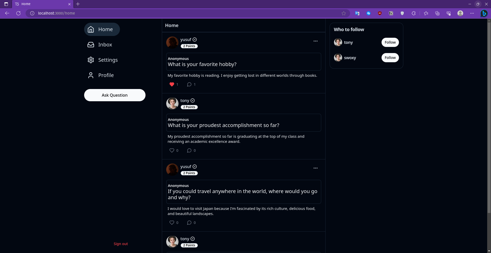
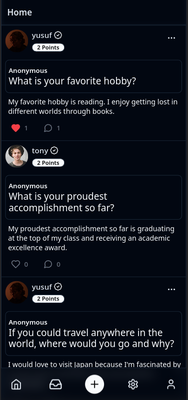

## **ASKANON**

|                               Web                               |                               Mobile                               |
| :-------------------------------------------------------------: | :----------------------------------------------------------------: |
|  |  |
|                                                                 |

Askanon is an anonymous question-asking platform that allows users to inquire about various topics while maintaining their anonymity. With Askanon, users can comfortably seek answers, advice, and opinions from a community of users without the fear of judgment or exposure.

### **Technologies Used**

Askanon is built using the following technologies:

- TRPC
- NEXTJS
- TAILWIND
- PRISMA
- TYPESCRIPT
